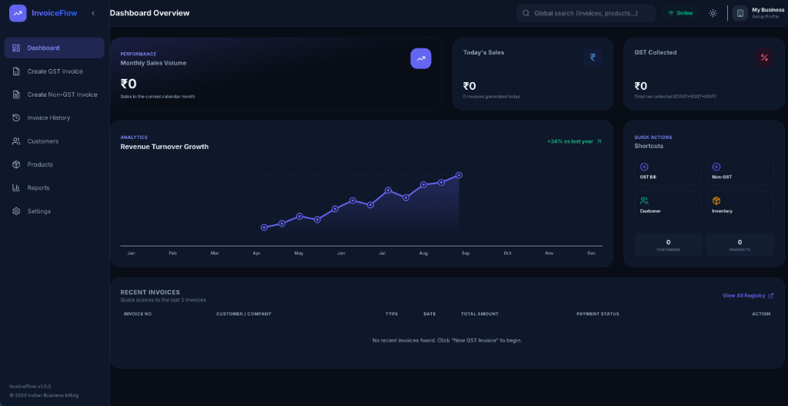
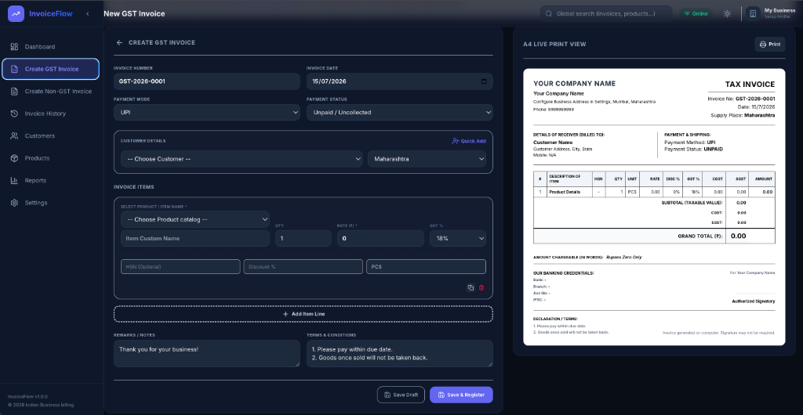
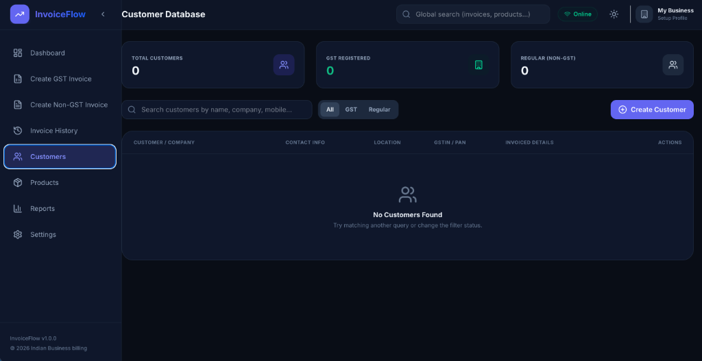
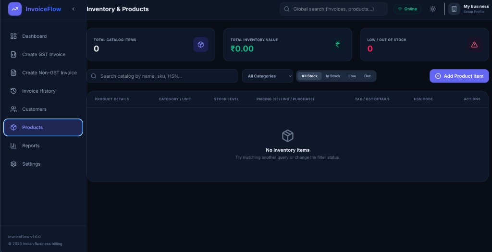
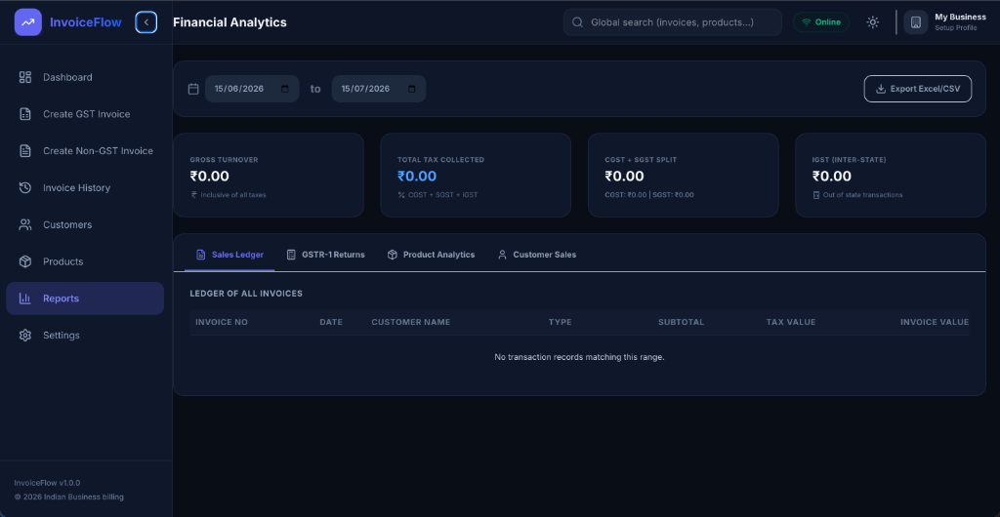

# ⚡ InvoiceFlow

A premium, state-of-the-art **GST & Non-GST Billing & Registry System** built with **React 19, Tailwind CSS v4, Express, and Supabase**. Designed with a high-end corporate aesthetic (class-based HSL color palettes, responsive layouts, and glassmorphic micro-animations).

---

## 📸 Screenshots Gallery

Add your screenshots in the `public/screenshots/` folder to populate this gallery:

### 📊 Bento Grid Dashboard


### ✍️ Split-Screen Invoice Creator


### 👥 Hybrid Customers Registry


### 📦 Hybrid Products Catalog


### 📈 Reports & Tax Analytics


---

## ✨ Features

- **📊 Bento Grid Dashboard**: An asymmetrical dashboard showing live metrics (turnover sales, customer statistics, inventory levels), dynamic SVG line charts, and quick-action shortcuts.
- **🧾 Split-Screen Invoice Creator**: Form inputs on the left side with a real-time, matching A4 printable sheet preview on the right. Works for both inter-state and intra-state sales.
- **💼 Dual Business Profiles**: Dedicated support for two distinct billing identities:
  - **GST Profile**: Captures corporate GSTIN, state codes, and tax rates.
  - **Non-GST Profile**: For simplified billing, estimates, and regular local profiles.
- **👥 Hybrid Customers Directory**: Advanced data table listing contact details, state indicators, and total historical billed value metrics with inline filters.
- **📦 Hybrid Inventory Catalog**: Track product SKU codes, categories, selling/purchase prices, tax brackets, and HSN codes with live color-coded stock alerts.
- **📈 Reports & Tax Analytics**: Real-time sales ledgers, GSTR-1 returns, customer turnovers, and product-specific analytics sheets exportable to CSV/Excel.
- **💾 Local Database Backups**: Single-click registry backup file generator to save your setup, with full JSON-based database restore capabilities.
- **🌓 Seamless Dark Mode**: Fully native class-based theme switcher supporting dark/light palettes.

---

## 🛠️ Technology Stack

- **Frontend**:
  - **React 19** & **TypeScript**
  - **Tailwind CSS v4** (with selector-based `@custom-variant dark` overrides)
  - **Framer Motion** (for smooth layout transition fades)
  - **Lucide Icons** (for modern, scalable vectors)
  - **Vite 8**
- **Backend & Database**:
  - **Node.js 20** (utilizing the native `--experimental-websocket` module)
  - **Express.js API**
  - **Supabase JS client** connection to **PostgreSQL** cloud instance

---

## 🚀 Setup & Installation

### 1. Clone & Install Dependencies
First, clone the repository and install packages for both the frontend and Express backend:
```bash
git clone https://github.com/OK45batwal/invoiceflow-billing.git
cd invoiceflow-billing

# Install frontend dependencies
npm install

# Install backend dependencies
cd server
npm install
```

### 2. Configure Environment Variables
Create a `.env` file in the `server/` directory:
```env
PORT=5001
SUPABASE_URL=your_supabase_project_url
SUPABASE_KEY=your_supabase_anon_key
```

### 3. Launch Development Server
Go back to the root workspace directory and launch the concurrent development task:
```bash
cd ..
npm run dev
```

- **Frontend client**: [http://localhost:5174](http://localhost:5174)
- **Backend API**: [http://localhost:5001](http://localhost:5001)
