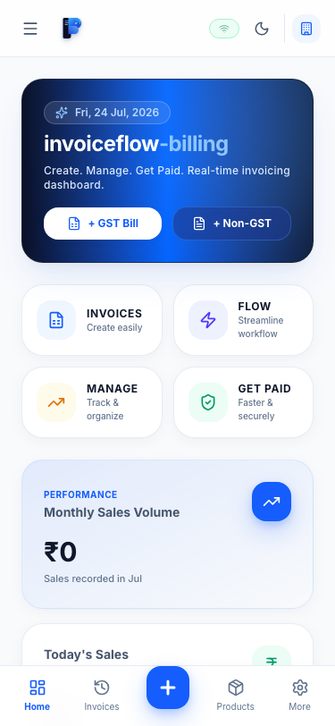

<div align="center">
  <br />
  
  
  # ⚡ invoiceflow-billing

  ### Smart Invoicing. Smooth Payments.
  
  *A modern, high-performance GST & Non-GST Billing System with real-time analytics, instant UPI QR payments, dual profile management, and light/dark theme support.*

  <p align="center">
    <a href="https://invoiceflow-billing.okbatwal.workers.dev">
      
    </a>
    <a href="https://github.com/OK45batwal/invoiceflow-billing">
      
    </a>
    <a href="https://github.com/OK45batwal/invoiceflow-billing">
      
    </a>
    <a href="https://github.com/OK45batwal/invoiceflow-billing">
      
    </a>
    <a href="https://github.com/OK45batwal/invoiceflow-billing">
      
    </a>
  </p>

  <p align="center">
    
    
    
  </p>
</div>

---

## 📸 Interactive Visual Gallery

<table border="0">
  <tr>
    <td width="65%">
      <p align="center"><b>📊 Desktop Bento Dashboard</b></p>
      
    </td>
    <td width="35%">
      <p align="center"><b>📱 Mobile App Dock View</b></p>
      
    </td>
  </tr>
</table>

---

InvoiceFlow Billing features a custom brand mark incorporating three meaningful financial elements:
- **The Folded Invoice Page (`I`)**: Structured bill document containing 3 detail lines `[ ≡ ]` representing GST compliance and billing data.
- **The Interlocking Flow Loop (`F`)**: Dual fluid ribbon arms (`#38BDF8` Cyan to `#0062FF` Electric Blue) symbolizing seamless cash flow and recurring revenue.
- **Upward Growth Flow Arrow (`↗`)**: Integrated cyan arrow representing financial growth and instant payment processing.

---

## ✨ Features & Modules

### 🧾 Dual GST & Non-GST Billing Engine
* **Real-time Live Preview**: Split-screen editor renders a print-ready A4 stylesheet instantly as items, quantities, and discounts change.
* **Automated Tax Calculations**: Automatic CGST, SGST, IGST, and rounding calculations based on place of supply.
* **Instant UPI Payment QR Codes**: Generates dynamic, scannable UPI payment QR codes on Non-GST cash memos.
* **One-Click Export**: Save and print bills directly as PDF.

### 📊 Real-Time Bento Grid Dashboard
* **Performance Metrics**: Live monthly sales volume, daily sales counters, and total accumulated GST.
* **Interactive Revenue Graph**: Real-time SVG growth trend chart calculated from invoice history.
* **4 Core Brand Pillars**: Integrated shortcuts for **Invoices**, **Flow**, **Manage**, and **Get Paid**.

### 🗄️ Directories & Reports
* **Customer Directory**: Complete logs of billing history, tax registration numbers (GSTIN), and contacts.
* **Product Catalog**: Stock tracking, HSN/SAC code mapping, and unit pricing.
* **Analytics & GSTR Reports**: Sales ledger exports and GST tax summaries.

### 🌗 Light & Dark Theme System
* **Tailwind v4 `@variant dark`**: Dynamic class-based theme switcher (`#F8FAFC` slate in light mode, `#0A1128` midnight navy in dark mode).

---

## 🛠️ Technology Stack

<table>
  <tr>
    <td align="center" width="25%">
      
      <br />
      <b>React 19</b>
    </td>
    <td align="center" width="25%">
      
      <br />
      <b>TypeScript</b>
    </td>
    <td align="center" width="25%">
      
      <br />
      <b>Tailwind v4</b>
    </td>
    <td align="center" width="25%">
      
      <br />
      <b>Vite 8</b>
    </td>
  </tr>
  <tr>
    <td align="center">
      
      <br />
      <b>Express.js</b>
    </td>
    <td align="center">
      
      <br />
      <b>Node.js</b>
    </td>
    <td align="center">
      
      <br />
      <b>Supabase DB</b>
    </td>
    <td align="center">
      
      <br />
      <b>Cloudflare Workers</b>
    </td>
  </tr>
</table>

---

## 🚀 Local Development Guide

### Prerequisites
- **Node.js**: v20 or higher
- **npm**: v10 or higher

### 1. Clone & Install
```bash
git clone https://github.com/OK45batwal/invoiceflow-billing.git
cd invoiceflow-billing
npm install
npm --prefix server install
```

### 2. Configure Environment
Create a `.env` file inside the `server/` directory:
```env
PORT=5001
SUPABASE_URL=your_supabase_project_url
SUPABASE_KEY=your_supabase_anon_key
```

### 3. Start Development Server
```bash
npm run dev
```
* **Client App**: [http://localhost:5173](http://localhost:5173)
* **Backend API**: [http://localhost:5001](http://localhost:5001)

### 4. Build for Production
```bash
npm run build
```

---

<div align="center">
  <p>
    <a href="https://invoiceflow-billing.okbatwal.workers.dev">🌐 Live Application</a>
    ·
    <a href="https://github.com/OK45batwal/invoiceflow-billing/issues">🐛 Report Bug</a>
    ·
    <a href="https://github.com/OK45batwal/invoiceflow-billing/issues">✨ Request Feature</a>
  </p>
  <p>Crafted with ❤️ for Indian Small & Medium Businesses</p>
</div>
