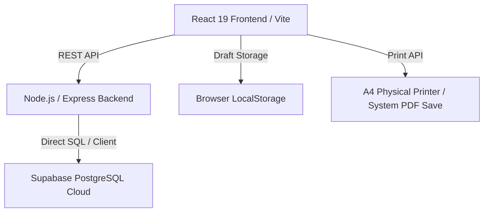

# Implementation Plan - InvoiceFlow

InvoiceFlow is a professional, production-ready GST & Non-GST Invoice Generator Website tailored for Indian businesses. The system features a responsive React dashboard, an Express.js backend, and a Supabase PostgreSQL database. It supports offline drafting via LocalStorage and state-aware GST calculations (CGST/SGST/IGST).

---

## User Review Required

> [!IMPORTANT]
> **Supabase Project Creation**: I will automate the creation of a free-tier Supabase project (`OK45batwal's Org`) via the Supabase MCP. If you prefer using a local PostgreSQL database or an existing Supabase URL/Key, please specify it in your feedback.
>
> **A4 Printing & PDF Download**: For standard-compliant invoicing in India, browser A4 printing is highly reliable for physical invoices. We will implement both:
> 1. A dedicated print-media stylesheet to ensure A4 browser prints are pixel-perfect.
> 2. PDF downloads using client-side libraries.

---

## Open Questions
- Do you have a preferred invoice prefix structure? (e.g., `INV/2026/0001` or `IF/0001`). We will set a default format like `INV-{YYYY}-{NUM}` with auto-increment, configurable in settings.
- Do you want mock data (mock customers, products, and invoices) pre-seeded into the database so the dashboard is immediately populated?

---

## Proposed Architecture



### File Structure

We will structure the project with:
1. **Frontend Vite React App** at the root of the workspace.
2. **Backend Express Server** in the `/server` directory.

```
invoiceflow-billing/
├── package.json             # Root monorepo scripts and dependencies (concurrently)
├── postcss.config.js
├── tailwind.config.js
├── index.html
├── src/
│   ├── assets/              # Static media assets
│   ├── components/          # Reusable components
│   │   ├── ui/              # Custom design system components (Dialog, Input, Button, Card, Toast)
│   │   ├── dashboard/       # Dashboard metrics & charts
│   │   ├── invoices/        # Invoice forms, item tables, preview panels
│   │   ├── customers/       # Customer forms & tables
│   │   ├── products/        # Product forms & tables
│   │   ├── reports/         # Report displays & export buttons
│   │   ├── settings/        # Settings & Business Profile forms
│   │   └── layout/          # Sidebar, Navbar, Page Containers
│   ├── pages/               # Main Page components
│   │   ├── Dashboard.tsx
│   │   ├── GSTInvoice.tsx
│   │   ├── NonGSTInvoice.tsx
│   │   ├── Customers.tsx
│   │   ├── Products.tsx
│   │   ├── Reports.tsx
│   │   └── Settings.tsx
│   ├── hooks/               # Custom hooks (useLocalStorage, useDebounce)
│   ├── utils/               # Math, GST Engine, Date and word converters
│   ├── services/            # API client services
│   ├── context/             # Global Contexts (Theme, Business Profile, Offline)
│   ├── types/               # TypeScript interfaces
│   ├── App.tsx
│   └── main.tsx
├── server/
│   ├── package.json         # Backend dependencies (express, pg, cors, dotenv)
│   ├── server.js            # Express application entrypoint
│   └── db.js                # Database pool connection config
└── supabase/
    └── migrations/
        └── schema.sql       # Database schema initialization
```

---

## Database Schema (PostgreSQL)

### 1. `business_profile`
Contains the details of the invoicing business. Supports a single-seller profile per deployment.
```sql
CREATE TABLE business_profile (
    id UUID PRIMARY KEY DEFAULT gen_random_uuid(),
    business_name VARCHAR(255) NOT NULL,
    logo_url TEXT,
    address TEXT NOT NULL,
    city VARCHAR(100) NOT NULL,
    state VARCHAR(100) NOT NULL,
    state_code VARCHAR(10) NOT NULL,
    gstin VARCHAR(15),
    pan VARCHAR(10),
    email VARCHAR(255),
    website VARCHAR(255),
    phone VARCHAR(20) NOT NULL,
    alt_phone VARCHAR(20),
    bank_name VARCHAR(255),
    branch VARCHAR(255),
    account_number VARCHAR(50),
    ifsc_code VARCHAR(20),
    upi_id VARCHAR(100),
    qr_code_url TEXT,
    created_at TIMESTAMP WITH TIME ZONE DEFAULT timezone('utc'::text, now()) NOT NULL,
    updated_at TIMESTAMP WITH TIME ZONE DEFAULT timezone('utc'::text, now()) NOT NULL
);
```

### 2. `customers`
```sql
CREATE TABLE customers (
    id UUID PRIMARY KEY DEFAULT gen_random_uuid(),
    name VARCHAR(255) NOT NULL,
    company_name VARCHAR(255),
    gstin VARCHAR(15),
    pan VARCHAR(10),
    address TEXT NOT NULL,
    city VARCHAR(100) NOT NULL,
    state VARCHAR(100) NOT NULL,
    state_code VARCHAR(10) NOT NULL,
    country VARCHAR(100) DEFAULT 'India',
    email VARCHAR(255),
    mobile VARCHAR(20) NOT NULL,
    notes TEXT,
    created_at TIMESTAMP WITH TIME ZONE DEFAULT timezone('utc'::text, now()) NOT NULL
);
```

### 3. `products`
```sql
CREATE TABLE products (
    id UUID PRIMARY KEY DEFAULT gen_random_uuid(),
    name VARCHAR(255) NOT NULL,
    category VARCHAR(100),
    hsn_code VARCHAR(20),
    sku VARCHAR(50),
    description TEXT,
    unit VARCHAR(20) DEFAULT 'PCS',
    selling_price NUMERIC(12,2) NOT NULL,
    purchase_price NUMERIC(12,2),
    gst_rate NUMERIC(5,2) DEFAULT 0.00,
    cgst_rate NUMERIC(5,2) DEFAULT 0.00,
    sgst_rate NUMERIC(5,2) DEFAULT 0.00,
    stock INTEGER DEFAULT 0,
    barcode VARCHAR(100),
    image_url TEXT,
    created_at TIMESTAMP WITH TIME ZONE DEFAULT timezone('utc'::text, now()) NOT NULL
);
```

### 4. `invoices`
Stores the invoice headers. Note that the customer and seller details are duplicated as a JSON snapshot (`customer_snapshot`, `seller_snapshot`) to prevent historical modifications when a customer or business profile is edited.
```sql
CREATE TABLE invoices (
    id UUID PRIMARY KEY DEFAULT gen_random_uuid(),
    invoice_number VARCHAR(100) UNIQUE NOT NULL,
    invoice_type VARCHAR(50) NOT NULL, -- 'GST', 'Non-GST', 'Quotation', 'Estimate', 'Proforma', 'Challan'
    invoice_date DATE NOT NULL DEFAULT CURRENT_DATE,
    due_date DATE,
    payment_mode VARCHAR(50) NOT NULL, -- 'Cash', 'UPI', 'Card', 'Cheque', 'Bank Transfer'
    payment_status VARCHAR(50) DEFAULT 'Unpaid', -- 'Paid', 'Partially Paid', 'Unpaid', 'Overdue'
    place_of_supply VARCHAR(100) NOT NULL,
    reverse_charge BOOLEAN DEFAULT FALSE,
    customer_id UUID REFERENCES customers(id) ON DELETE SET NULL,
    customer_snapshot JSONB NOT NULL,
    seller_snapshot JSONB NOT NULL,
    subtotal NUMERIC(12,2) NOT NULL DEFAULT 0.00,
    cgst_total NUMERIC(12,2) NOT NULL DEFAULT 0.00,
    sgst_total NUMERIC(12,2) NOT NULL DEFAULT 0.00,
    igst_total NUMERIC(12,2) NOT NULL DEFAULT 0.00,
    round_off NUMERIC(12,2) NOT NULL DEFAULT 0.00,
    grand_total NUMERIC(12,2) NOT NULL DEFAULT 0.00,
    notes TEXT,
    terms_conditions TEXT,
    created_at TIMESTAMP WITH TIME ZONE DEFAULT timezone('utc'::text, now()) NOT NULL
);
```

### 5. `invoice_items`
```sql
CREATE TABLE invoice_items (
    id UUID PRIMARY KEY DEFAULT gen_random_uuid(),
    invoice_id UUID REFERENCES invoices(id) ON DELETE CASCADE,
    product_id UUID REFERENCES products(id) ON DELETE SET NULL,
    product_name VARCHAR(255) NOT NULL,
    description TEXT,
    hsn_code VARCHAR(20),
    quantity NUMERIC(12,3) NOT NULL,
    unit VARCHAR(20) DEFAULT 'PCS',
    rate NUMERIC(12,2) NOT NULL,
    discount_pct NUMERIC(5,2) DEFAULT 0.00,
    gst_rate NUMERIC(5,2) DEFAULT 0.00,
    cgst_rate NUMERIC(5,2) DEFAULT 0.00,
    sgst_rate NUMERIC(5,2) DEFAULT 0.00,
    cgst_amount NUMERIC(12,2) DEFAULT 0.00,
    sgst_amount NUMERIC(12,2) DEFAULT 0.00,
    igst_amount NUMERIC(12,2) DEFAULT 0.00,
    amount NUMERIC(12,2) NOT NULL
);
```

---

## GST Calculation Engine (Logic)
- If the customer is from the **same state** as the seller (derived by comparing the first 2 characters of their GSTINs or state names), apply **CGST** and **SGST** (each = $GST \div 2$).
- If they are from **different states**, apply **IGST** ($IGST = GST$).
- Calculations:
  - $\text{Discounted Price} = \text{Rate} \times \left(1 - \frac{\text{Discount\%}}{100}\right)$
  - $\text{Taxable Value} = \text{Discounted Price} \times \text{Quantity}$
  - $\text{Tax Amount} = \text{Taxable Value} \times \frac{\text{GST\%}}{100}$
  - $\text{Item Total} = \text{Taxable Value} + \text{Tax Amount}$

---

## Verification Plan

### Automated Verification
- Run Vite build to ensure no TypeScript or packaging compiler errors: `npm run build`.
- Run Node server startup check: `node server/server.js` or dry run endpoints.

### Manual Verification
- **Invoice Draft Saving**: Check if draft invoices are saved to local storage when offline or when saving drafts explicitly.
- **GST Calculations Verification**: Add an item with ₹10,000 rate, 10% discount, 18% GST:
  - Taxable value should be ₹9,000.
  - Total GST should be ₹1,620 (either ₹810 CGST + ₹810 SGST, or ₹1,620 IGST).
  - Total amount should be ₹10,620.
- **A4 Print Layout**: Trigger print view in browser and inspect print margins, page breaks, and layout alignment.
